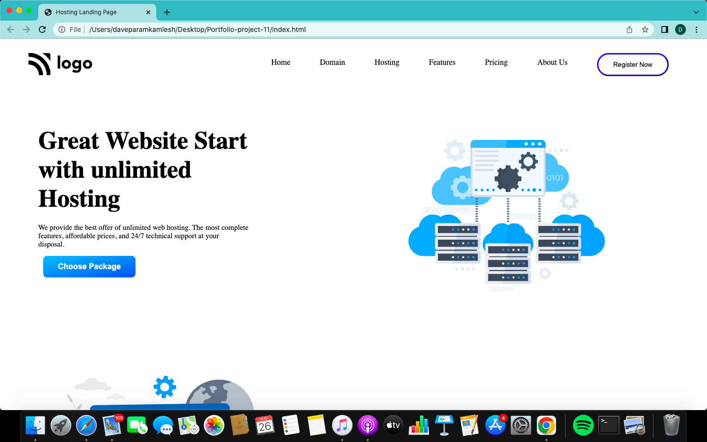
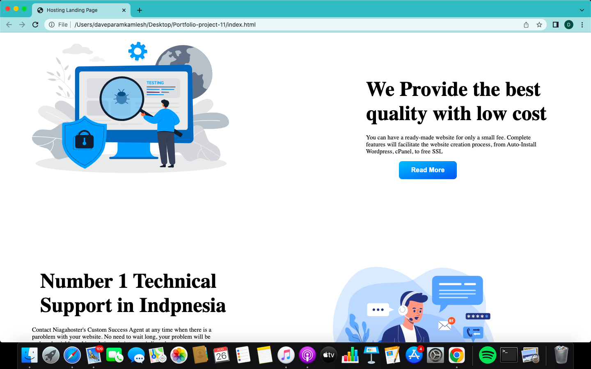
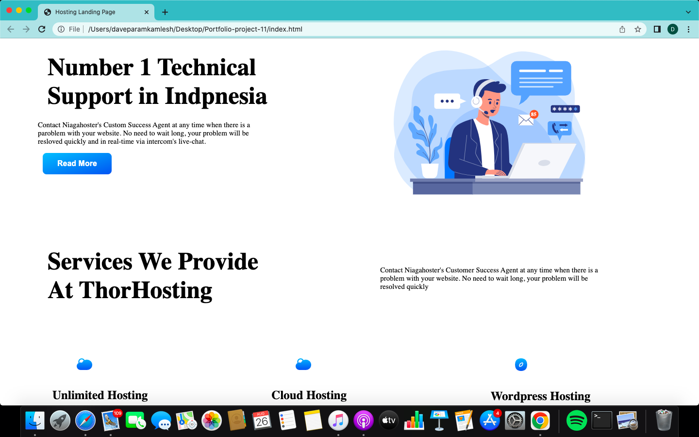
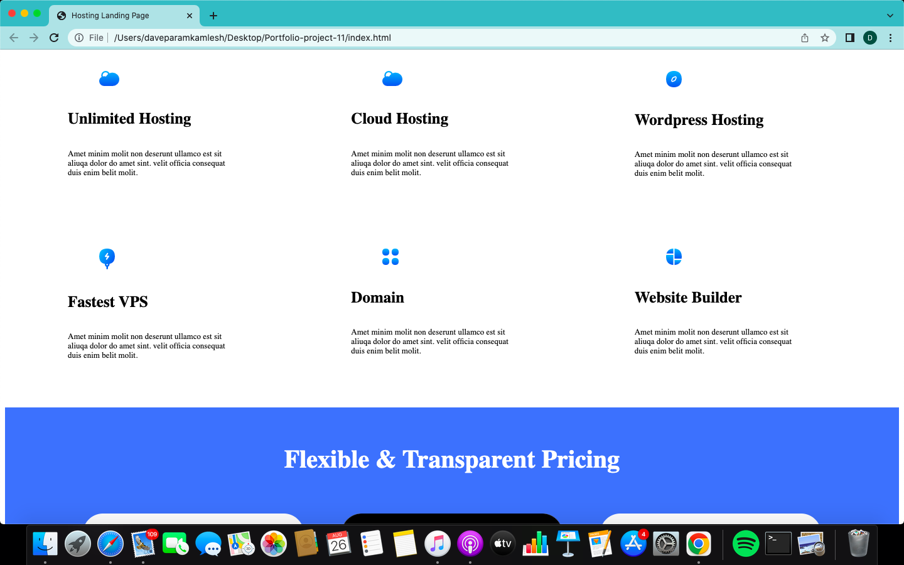

# Portfolio project 11

This is a one page portfolio template project made in HTML and CSS.

# Project live link

[Portfolio-project-11](https://stupendous-cocada-18b64e.netlify.app)

# Screenshot

# My learnings from this projects

- I learned to design beautiful buttons and navbar.
- I learned to Postion of photo.
- I learned to make beautiful page with html and css.

# Time to finish the projecet

I took about 10-12 hours approximately to complete this project.
